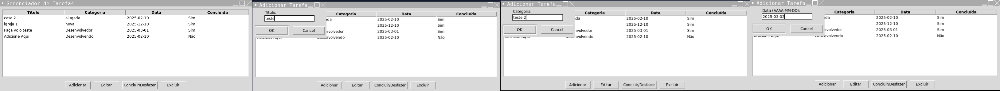

# Projeto Gerenciador de Tarefas   


🐍 *Python   + Tkinter*


**Feito com Python e Tkinter**

                                                                        

Bem-vindo ao **Gerenciador de Tarefas**, um exemplo de aplicativo simples e funcional para organizar suas tarefas diárias! Desenvolvido com paixão e cuidado, este projeto permite adicionar, editar, concluir e excluir tarefas de forma intuitiva, com uma interface gráfica amigável.

  
                      


## ✨ Funcionalidades
- **Adicionar Tarefas**: Crie novas tarefas com título, categoria, data de vencimento e status (concluída ou não).
- **Editar Tarefas**: Modifique detalhes de tarefas existentes com facilidade.
- **Concluir/Desfazer**: Marque tarefas como concluídas ou reverta o status rapidamente.
- **Excluir Tarefas**: Remova tarefas que não são mais necessárias.
- **Persistência**: Tarefas são salvas em um arquivo JSON para uso contínuo.

---

## 🚀 Como Testar Online
Você pode testar o Gerenciador de Tarefas diretamente no navegador, sem precisar baixar ou instalar nada!  
1. Clique [aqui](https://replit.com/@joseescudero03/Projeto-gerenciador-de-tarefas) para acessar o projeto no Replit.  
2. Pressione o botão **"Run"** (triângulo verde)  ou **"stop"** em (cinza) , se trava pressione novamente o botao no topo da página.  
3. A interface gráfica será exibida, pronta para uso!

> **Nota**: No plano gratuito do Replit, o aplicativo "dorme" após um período sem uso. Basta clicar em "Run" novamente para reativá-lo.

---

## 🛠 Tecnologias e Frameworks Utilizados
Este projeto foi construído com as seguintes ferramentas e tecnologias:

- **[Python](https://www.python.org/)**: Linguagem de programação principal, conhecida por sua simplicidade e versatilidade.
- **[Tkinter](https://docs.python.org/3/library/tkinter.html)**: Biblioteca padrão do Python para criar interfaces gráficas desktop.
- **[ ttk (Tkinter Themed Widgets)](https://docs.python.org/3/library/tkinter.ttk.html)**: Extensão do Tkinter para widgets mais modernos e estilizados.
- **[JSON](https://www.json.org/)**: Formato leve usado para salvar e carregar as tarefas em um arquivo (`tarefas.json`).
- **[datetime](https://docs.python.org/3/library/datetime.html)**: Módulo do Python para manipulação de datas nas tarefas.
- **[Replit](https://replit.com/)**: Plataforma online gratuita para hospedar e executar o aplicativo no navegador.
- **[Git](https://git-scm.com/)**: Sistema de controle de versão para gerenciar o código.
- **[GitHub](https://github.com/)**: Plataforma para armazenar o repositório público do projeto.

---

## 📋 Pré-requisitos
Para rodar localmente (opcional):
- Python 3.6 ou superior instalado.
- Nenhuma dependência externa além das bibliotecas padrão do Python.

---

## 🏃 Como Rodar Localmente
Se quiser executar o projeto no seu computador:
1. Clone o repositório:
   ```bash
   git clone https://github.com/Escudero03/Projeto--gerenciador-de-tarefas.git
   
2. Navegue até o diretório:
cd Projeto--gerenciador-de-tarefas

3. Executre o programa:
 python main.py

---

📂 Estrutura do Projeto

Projeto--gerenciador-de-tarefas/

├── main.py          # Código principal do aplicativo

├── tarefas.json     # Arquivo que armazena as tarefas (gerado automaticamente)

├── .replit         # Configuração do Replit para execução online

└── README.md       # Este arquivo

---

📜 Licença
Este projeto é de código aberto e está disponível sob a MIT License.

🌟 Agradecimentos
À comunidade Python por ferramentas incríveis.
Ao Replit por fornecer hospedagem gratuita.
E a você, por testar e apoiar este projeto!

---

Feito  por Jose Escudero (um dev em aprendizado!).

"DEV APRENDIZADO" - Porque cada linha de código é um passo adiante!


---

### **Explicação**
- **Título e Introdução**: Um cabeçalho chamativo com uma breve descrição e uma imagem placeholder (você pode tirar um screenshot do app e hospedá-lo para substituir).
- **Funcionalidades**: Lista clara do que o app faz.
- **Como Testar Online**: Instruções simples com o link do Replit.
- **Tecnologias**: Todas as ferramentas usadas (Python, Tkinter, ttk, JSON, datetime, Replit, Git, GitHub).
- **Pré-requisitos e Como Rodar Localmente**: Para quem quiser baixar e executar.
- **Estrutura**: Mostra os arquivos do projeto.
- **Contribuições, Licença e Agradecimentos**: Toques profissionais para engajar a comunidade.


